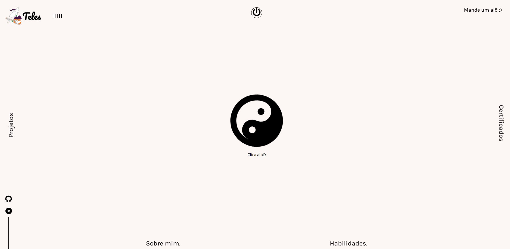
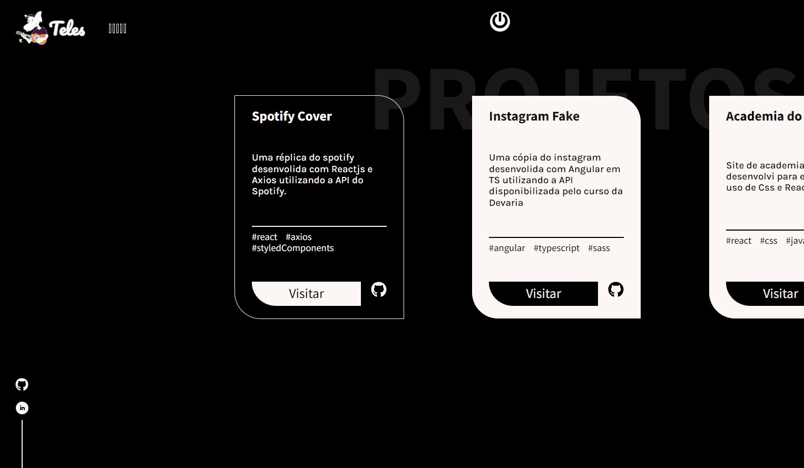
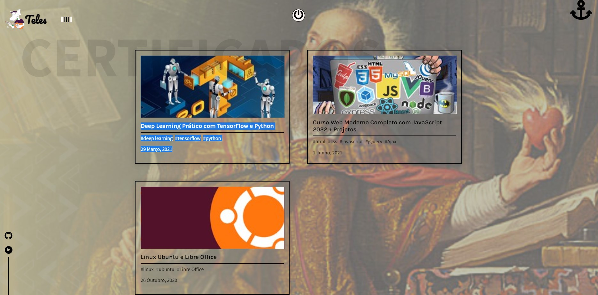
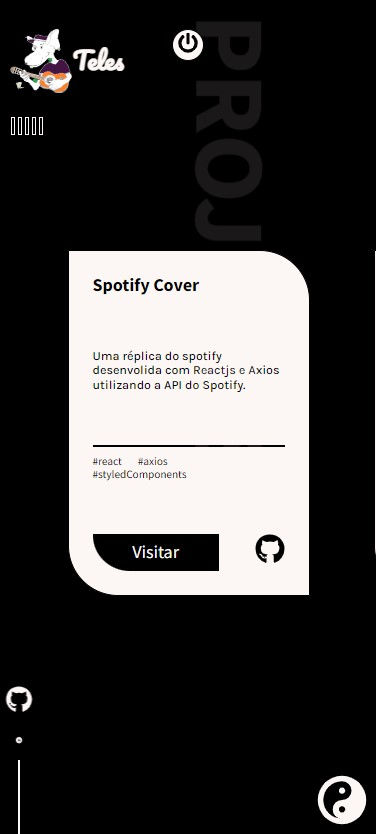
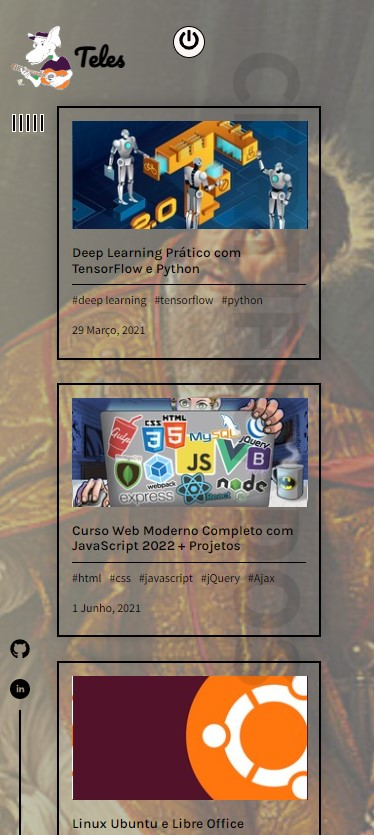

# Site pessoal desenvolvido em React

Site para auxiliar na apresentação do meu trabalho. Contendo de forma bem resumida minha história, meus projetos e cursos que eu fiz durante minha carreira na aréa de programação.

Comecei a programar na faculdade quando o professor de algoritimos disse para fazermos um jogo utilizando lua e Love2D como plataforma. Fiz meu primeiro CRUD em C++ na disciplina de linguagem de programação e comecei a aprender sobre Inteligencia Artificial em Python, entrei em um projeto de pesquisa e escrevi meu primeiro artigo cientifico.

Apresentei-o em dezembro de 2022, no mesmo mês em que comecei a estagiar.Inclusive, escrevo esta descrição como sendo um estagiário desenvolvedor na Tarken AG. To aprendendo muito aqui e aproveitar o máximo fato de eu ser estagiário rs.

# Ver site👇:  
https://felipeteles.herokuapp.com/

# Imagens do site:

# Ferramentas utilizadas no projeto

Linguagem utilizada foi o Javascript: https://www.javascript.com/  
Biblioteca utilizada foi o React: https://reactjs.org/  
Design feito no: https://www.figma.com/  
Svg Icons de: https://fontawesome.com/   
Audio: playlist.js  

# Caso queira os scripts 

siga o poema

`npm i`

, rodar código

`npm start`

e _curtir_ rs
